# 🎬 Movie Review Sentiment Analysis

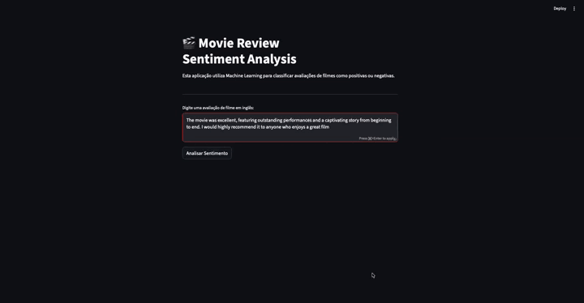

## Integrantes

| Nome              | RA      |
| ----------------- | ------- |
| Guilherme Vicente | 1992017 |
| Integrante 2      | XXXXXXX |
| Integrante 3      | XXXXXXX |

---

## Descrição do Problema

Com a popularização das plataformas de streaming e sites de avaliação de filmes, milhares de reviews são publicadas diariamente. Analisar manualmente todas essas opiniões é inviável, tornando necessária a utilização de técnicas de Inteligência Artificial capazes de identificar automaticamente se uma avaliação expressa um sentimento positivo ou negativo.

---

## Objetivo do Projeto

Desenvolver um modelo de Machine Learning capaz de classificar automaticamente avaliações de filmes em inglês como **positivas** ou **negativas**, utilizando técnicas de Processamento de Linguagem Natural (NLP).

Além disso, disponibilizar o modelo através de uma aplicação web interativa desenvolvida com **Streamlit**.

---

## Dataset Utilizado

**IMDB Dataset**

O dataset contém avaliações de filmes em inglês rotuladas como:

- `positive`
- `negative`

| Característica     | Detalhe                        |
|--------------------|-------------------------------|
| Total de reviews   | 50.000                        |
| Balanceamento      | Base balanceada               |
| Tipo de dado       | Textos reais de usuários      |
| Uso comum          | Amplamente utilizado em NLP   |

```
IMDB Dataset.csv
```

---

## Tipo de Problema

> **Classificação Supervisionada Binária**
>
> - `1` → Positive
> - `0` → Negative

---

## Metodologia

### 1. Carregamento dos Dados
Leitura do dataset utilizando **Pandas**.

### 2. Limpeza dos Dados
Foi criada uma função responsável por:
- Converter texto para minúsculas
- Remover tags HTML
- Remover pontuação
- Remover caracteres desnecessários

### 3. Análise Exploratória dos Dados (EDA)

#### Distribuição dos Sentimentos
O dataset é balanceado, com uma media  **25.000 reviews positivas** e **25.000 negativas**, pois o dataSet tinha 418 registros duplicados.

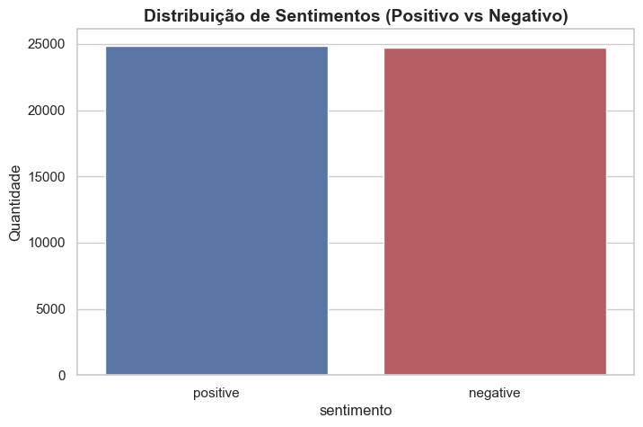

---

#### Tamanho das Reviews
As reviews positivas e negativas possuem distribuição de tamanho semelhante, com mediana em torno de 200 palavras e alguns outliers com mais de 700 palavras.

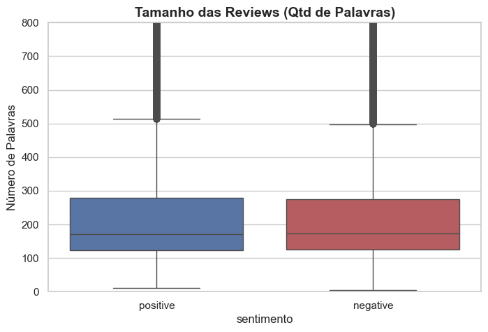

---

#### Nuvens de Palavras

**Reviews Positivas:**

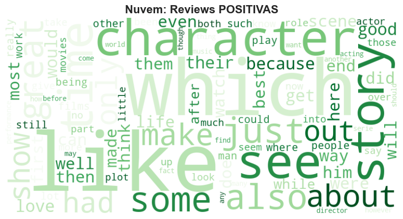

**Reviews Negativas:**

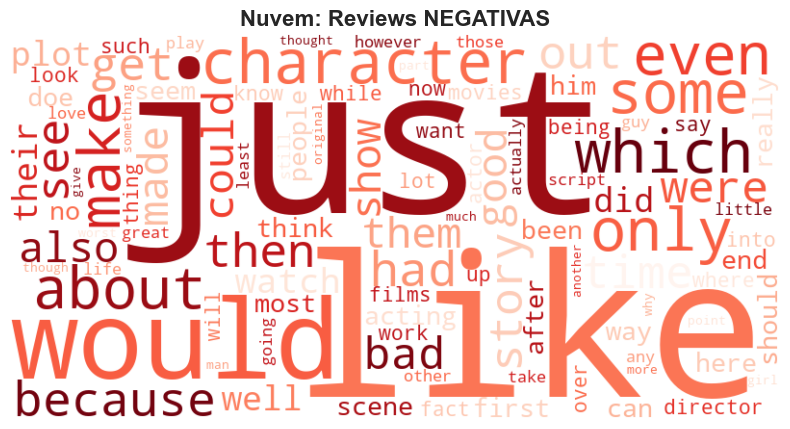

---

#### Top 10 Bigramas

**Positivos:**

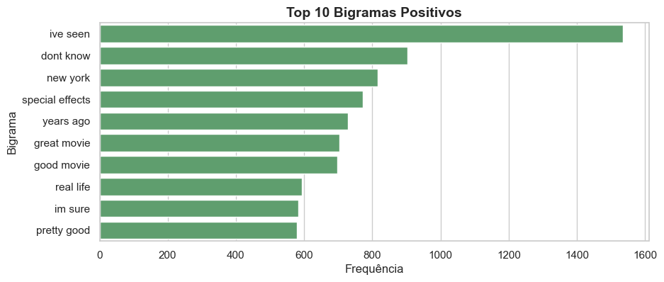

**Negativos:**

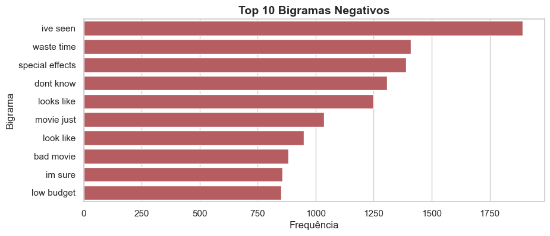

---

#### Top 10 Trigramas

**Positivos:**

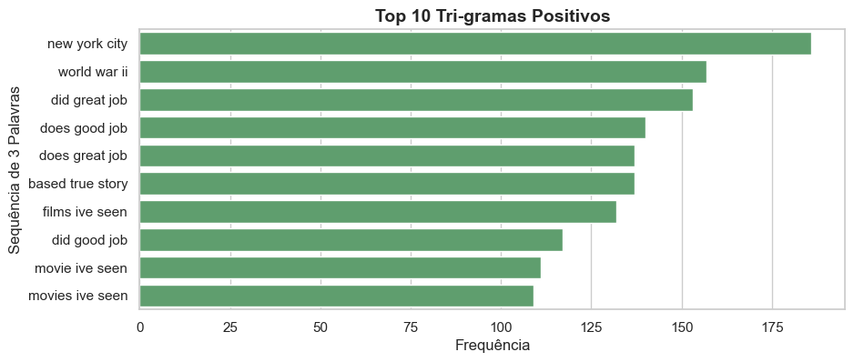

**Negativos:**

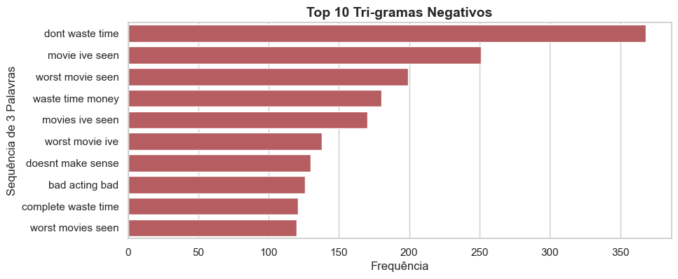

---

### 4. Pré-processamento

Transformação dos textos utilizando:

```python
TfidfVectorizer
```

Divisão dos dados:

| Split      | Proporção |
|------------|-----------|
| Treino     | 60%       |
| Validação  | 20%       |
| Teste      | 20%       |

### 5. Treinamento dos Modelos

Foi utilizado **K-Fold Cross Validation** com `k = 3`.

---

## Modelos Treinados

| Modelo                    | Classe Python       |
|--------------------------|---------------------|
| Multinomial Naive Bayes  | `MultinomialNB()`   |
| Regressão Logística      | `LogisticRegression()` |
| Support Vector Machine   | `LinearSVC()`       |

---

## Modelo Final Escolhido

### ✅ Logistic Regression

Motivos da escolha:
- Melhor desempenho geral
- Alta capacidade de generalização
- Excelente desempenho em classificação de texto
- Facilidade de interpretação dos pesos das palavras

---

## Métricas de Avaliação

- Accuracy
- Precision
- Recall
- F1-Score
- ROC-AUC

---

## Resultados

### Matrizes de Confusão

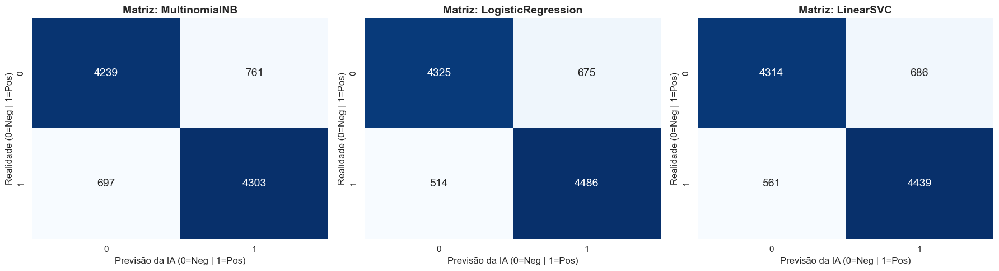

### Curvas ROC / AUC

| Modelo              | AUC   |
|---------------------|-------|
| MultinomialNB       | 0.932 |
| LogisticRegression  | 0.954 |
| LinearSVC           | 0.949 |


A **Regressão Logística** obteve o maior AUC (0.954), confirmando sua superioridade em discriminar reviews positivas de negativas.

---

### Raio-X da IA: Palavras com Maior Impacto

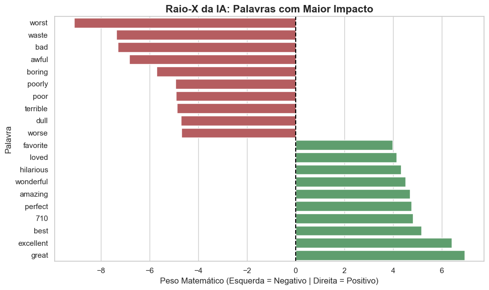

As palavras com maior impacto **positivo** incluem: `great`, `excellent`, `best`, `perfect`, `amazing`, `wonderful`.

As palavras com maior impacto **negativo** incluem: `worst`, `waste`, `bad`, `awful`, `boring`.

---

## Estrutura dos Arquivos

```
projeto/
│
├── app.py
├── prova.ipynb
├── requirements.txt
│
├── model/
│   ├── modelo_final.pkl
│   └── vetorizador.pkl
│
├── data/
│   └── IMDB Dataset.csv
│
├── notebooks/
│   └── prova.ipynb
│
├── image/
│   └── Imagens do README.md
│
├── reports/
│   └── Relatorio.pdf
│
└── README.md
```

---

## Tecnologias Utilizadas

### Linguagem
- Python

### Bibliotecas

| Biblioteca   | Uso                          |
|-------------|-------------------------------|
| Pandas      | Manipulação de dados          |
| NumPy       | Operações numéricas           |
| Matplotlib  | Visualizações                 |
| Seaborn     | Visualizações estatísticas    |
| Scikit-Learn| Modelos e métricas de ML      |
| Joblib      | Serialização de modelos       |
| WordCloud   | Nuvens de palavras            |
| Streamlit   | Aplicação web interativa      |

### Técnicas
- NLP (Processamento de Linguagem Natural)
- TF-IDF
- Cross Validation (K-Fold)
- Logistic Regression
- Naive Bayes
- SVM (LinearSVC)

---

## Como Executar o Notebook

### 1. Instalar dependências

```bash
pip install pandas numpy matplotlib seaborn scikit-learn joblib wordcloud streamlit
```

### 2. Abrir o notebook

```bash
jupyter notebook
```

ou

```bash
code .
```

### 3. Executar todas as células

Certifique-se de ajustar o caminho do dataset:

```python
df = pd.read_csv('IMDB Dataset.csv')
```

---

## Como Executar o Aplicativo Streamlit

### 1. Instalar dependências

```bash
pip install -r requirements.txt
```

### 2. Executar o aplicativo

```bash
streamlit run app.py
```

### 3. Abrir no navegador

```
http://localhost:8501
```

---

## Link do Aplicativo Publicado

```
https://imdbiaprova-cjh4xzbnizoebvutegmybg.streamlit.app
```

---

## Limitações

- Classifica apenas sentimentos positivos e negativos
- Treinado exclusivamente com reviews de filmes
- Textos muito curtos podem gerar classificações imprecisas
- Não compreende sarcasmo ou ironia de forma perfeita
- Utiliza apenas textos em inglês

---

### Avaliação Final no Conjunto de Teste

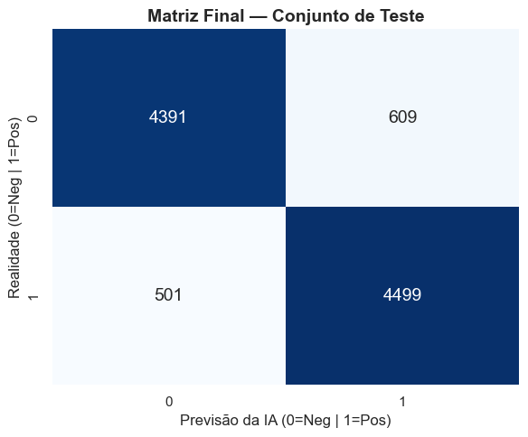

| Métrica   | Valor  |
|-----------|--------|
| Acurácia  | 0.8890 |
| Precisão  | 0.8808 |
| Recall    | 0.8998 |
| F1-Score  | 0.8902 |

A avaliação final no conjunto de teste — 20% dos dados completamente
isolados desde o início — confirmou a capacidade de generalização do
modelo. Com 89% de acurácia e equilíbrio perfeito entre as classes
(ambas com F1 = 0.89), o modelo demonstra que não decorou os dados
de treino e performa de forma consistente em dados inéditos.
---

## Conclusão

O projeto demonstrou a eficácia das técnicas de Processamento de Linguagem Natural e Machine Learning para análise automática de sentimentos.

Através do uso do **TF-IDF** e da **Regressão Logística**, foi possível construir um classificador capaz de identificar corretamente o sentimento de avaliações de filmes com alto nível de precisão (AUC = **0.954**).

Além da construção e validação do modelo, o projeto foi disponibilizado através de uma aplicação **Streamlit**, permitindo que qualquer usuário realize predições de forma simples e intuitiva.
